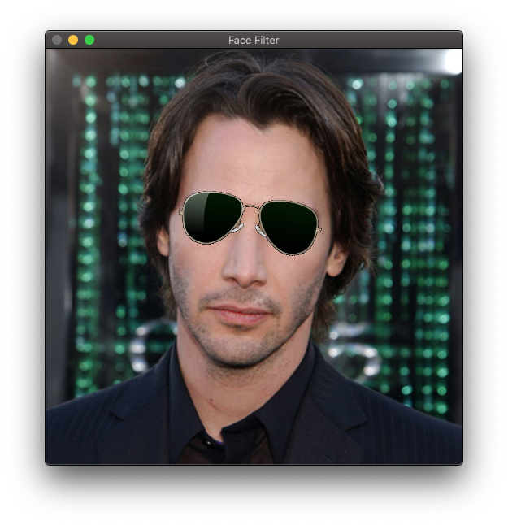

# Sunglasses Virtual Try-on

This program uses OpenCV to help people try on sunglasses virtually via webcam. It also works with a photo. For demo, please see `demo-video.gif` and `demo-photo.png`.

Demo:




## Dependencies for Running Locally
* cmake >= 3.11
  * All OSes: [click here for installation instructions](https://cmake.org/install/)
* make >= 4.1 (Linux, Mac), 3.81 (Windows)
  * Linux: make is installed by default on most Linux distros
  * Mac: [install Xcode command line tools to get make](https://developer.apple.com/xcode/features/)
  * Windows: [Click here for installation instructions](http://gnuwin32.sourceforge.net/packages/make.htm)
* gcc/g++ >= 5.4
  * Linux: gcc / g++ is installed by default on most Linux distros
  * Mac: same deal as make - [install Xcode command line tools](https://developer.apple.com/xcode/features/)
  * Windows: recommend using [MinGW](http://www.mingw.org/)
* OpenCV and OpenCV Contrib >= 4.3.0
  * Mac: `brew install opencv` or follow instructions at [Installation in MacOS](https://docs.opencv.org/4.3.0/d0/db2/tutorial_macos_install.html) to build opencv and opencv-contrib from source.
  * Linux: Follow instructions at [Installation in Linux](https://docs.opencv.org/4.3.0/d7/d9f/tutorial_linux_install.html) to build opencv and opencv-contrib from source.

## Build and Run Instructions

1. Make a build directory in the top level directory: `mkdir build && cd build`
2. Compile: `cmake .. && make`
3. Run it: `./FaceFilter`.
4. After prompt, enter 1 to use webcam, or enter 2 to use a photo. Make sure your terminal has permission to use webcam if you choose 1.
5. After prompt, choose from 3 different styles of sunglasses (0, 1, 2)
6. If you decided to run with a photo when webcam is not present, you need to also enter a path of an image. Enter 1 to use the default image.

## Code Strutcture

```bash
include
|__detector.h # abstract detector class header file
|__face_detector.h # face detector classes header file
|__face_landmark.h # face landmark classes header file
|__renderer.h # renderer header file
|__utils.h # utility functions header file
src
|__detector.cpp
|  # This source file contains code for a abstract detector class.
|  # A detector is used to analyze an image frame and output a bounding box for the
|  # region of interest of the target object. In this project, it is human face.
|__face_detector.cpp
|  # This source file contains implemetation of multiple face detectors.
|  # They both take an image matrix as input, and then output a list of boxes.
|__face_landmark.cpp
|  # This source file contains implemetation of the face landmarks detector.
|  # They both take an image matrix as input, and then output a nested list of 68 face landmarks.
|__renderer.cpp
|  # This source file contains core rendering loop and logic, such as querying face landmarks
|  # and warping image assets before applying to the face.
|__utils.cpp
|  # This source file contains many useful util functions used in other places.
|__main.cpp
|  # This is the entry point of the project.
```

## Rubric Points

This project has addressed the following rubric points:

### README

> Criteria: A README with instructions is included with the project.

File `README.md`

> Criteria: The README indicates which project is chosen.

File `README.md`

> Criteria: The README includes information about each rubric point addressed.

File `README.md`

### Compiling and Testing

> Criteria: The submission must compile and run.

File `CMakeLists.txt`. Also see `demo-build.png`.

### Loops, Functions, I/O

> Criteria: The project demonstrates an understanding of C++ functions and control structures.

File `src/utils.cpp` line 3 and line 33. I created functions to wrap some logic.

> Criteria: The project reads data from a file and process the data, or the program writes data to a file.

File `src/face_detector.cpp` line 8. I read a model file. And in `src/asset.cpp`, I loaded an image file.

> Criteria: The project accepts user input and processes the input.

File `src/utils.cpp` line 49, which is called by `src/main.cpp` line 15, accepts user input for sunglasses style.

### Object Oriented Programming

> Criteria: The project uses Object Oriented Programming techniques.

File `include/sunglasses.h` line 5, I defined a Sunglasses class to represent the asset.

> Criteria: Classes use appropriate access specifiers for class members.

File `include/asset.h` line 8 to 18, I defined public and protected members seperately. `_asset_image` will be used by derived class, so it's protected.

> Criteria: Class constructors utilize member initialization lists.

I didn't use member initialization lists because it doesn't work well with `std::make_unique`.

> Criteria: Classes abstract implementation details from their interfaces.

File `include/asset.h` line 12, `Render` is an interface for all `Asset`s, but needs to be overrode by derived class for detailed implementation.

> Criteria: Classes encapsulate behavior.

File `src/sunglasses.cpp` line 38, `Render` encapsulate the complicated logic of image transformation, so that the caller in `src/renderer.cpp` doesn't need to worry about it.

> Criteria: Classes follow an appropriate inheritance hierarchy.

File `include/sunglasses.h` line 5, `Sunglasses` class inherit from `Asset` class. There could be other type of assets such as `Earings`, `Hat`, etc.

> Criteria: Overloaded functions allow the same function to operate on different parameters.

File `include/renderer.h` line 13 and 14, `Start()` function takes different parameters for video and photo mode.

> Criteria: Derived class functions override virtual base class functions.

File `include/sunglasses.h` line 13, `Render` function override base class function in `Asset`.

> Criteria: Templates generalize functions in the project.

No need to use templataes.

### Memory Management

> Criteria: The project makes use of references in function declarations.

File `include/sunglasses.h` line 13, `Render` function takes a reference of big `image` object.

> Criteria: The project uses destructors appropriately.

File `src/asset.cpp` line 9, a destructor to use OpenCV API to release memory.

> Criteria: The project uses scope / Resource Acquisition Is Initialization (RAII) where appropriate.

File `src/renderer.cpp` line 23, `Renderer` instance will be take ownership of a list of `Asset`, and they are not shareable.

> Criteria: The project follows the Rule of 5.

File `src/sunglasses.cpp` line 4 to 31, implemented copy constructor, copy assigment operator, move constructor and move assignment operator. The destructor reuses the one from parent class `Asset`.  

> Criteria: The project uses move semantics to move data, instead of copying it, where possible.

File `src/renderer.cpp` line 38, moved the big image object when intialize.  

> Criteria: The project uses smart pointers instead of raw pointers.

File `src/renderer.cpp` line 23, assets are managed by `std::unique_ptr`. 

### Concurrency

> Criteria: The project uses multithreading.

Not implemented.

> Criteria: A promise and future is used in the project.

Not implemented.

> Criteria: A mutex or lock is used in the project.

Not implemented.

> Criteria: A condition variable is used in the project.

Not implemented.